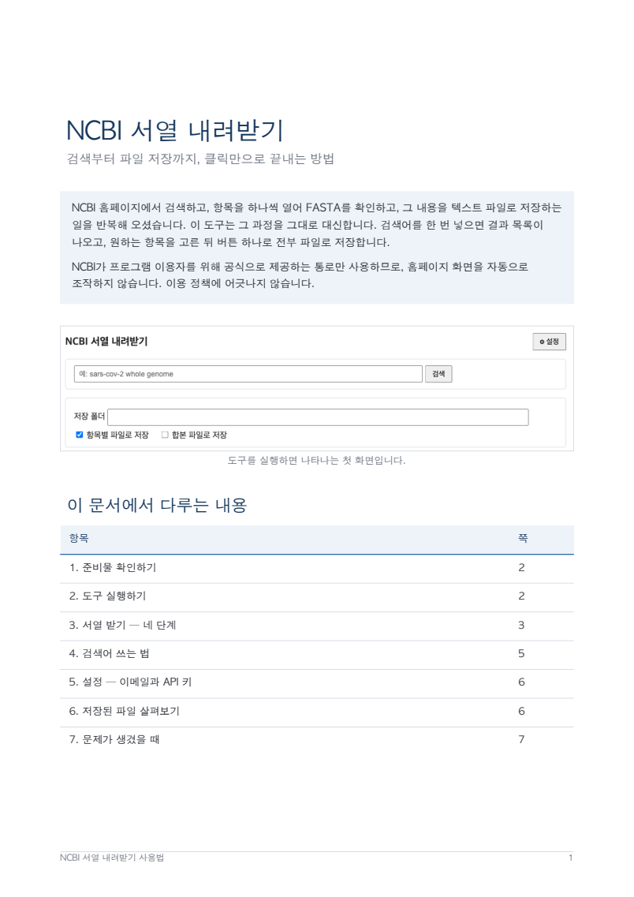
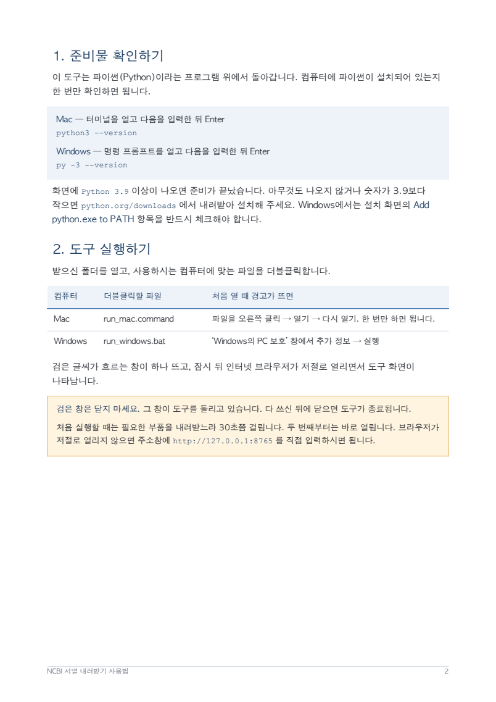
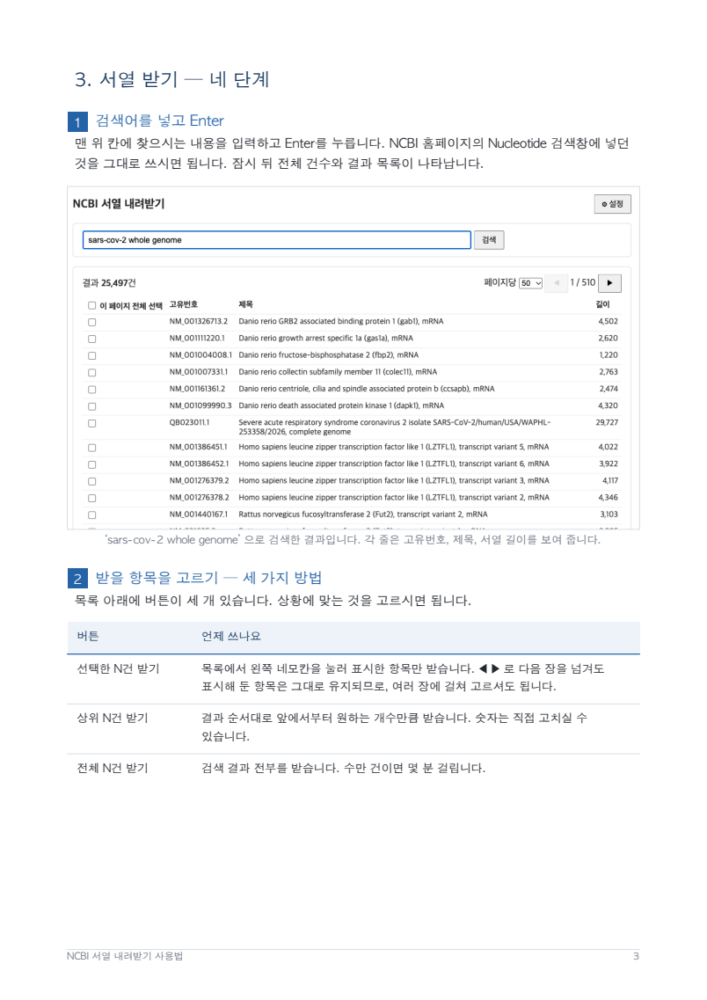
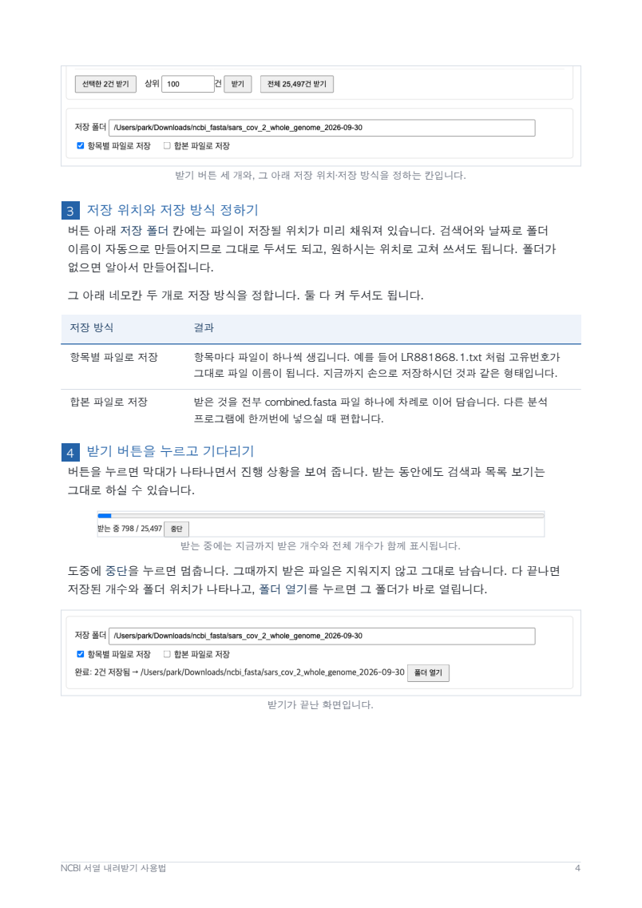
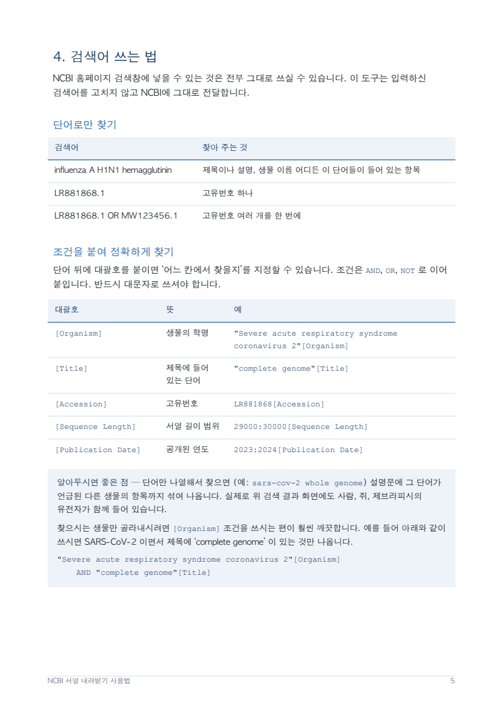
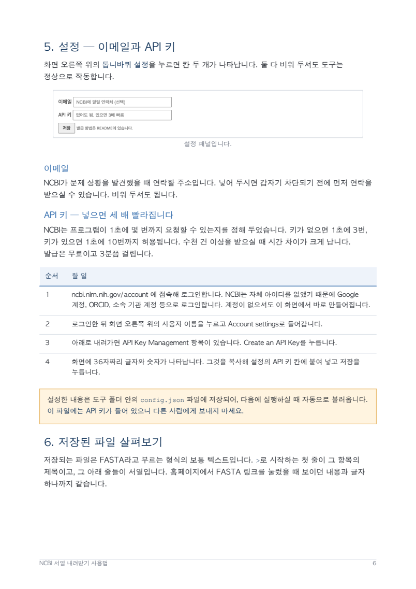
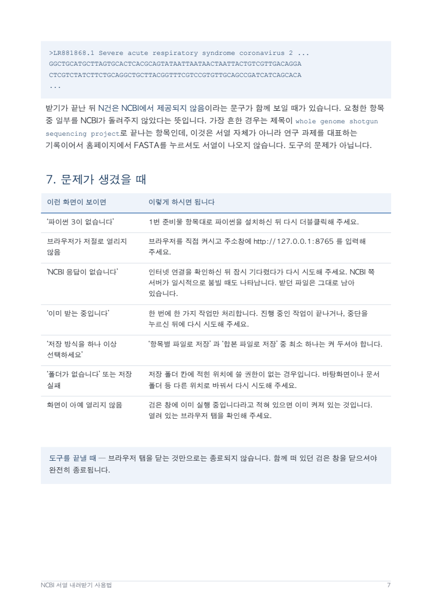

# NCBI 서열 내려받기

NCBI 웹사이트에서 검색 → 항목 클릭 → FASTA → 저장을 반복하던 일을 대신해 주는 도구입니다.
검색어를 넣으면 결과 목록이 나오고, 원하는 항목을 골라서(또는 상위 N건, 전체) 한 번에 파일로 저장합니다.

이 도구는 NCBI가 프로그램용으로 공식 제공하는 창구(E-utilities)만 사용합니다. 웹사이트 화면을 자동으로
조작하지 않으므로 NCBI 이용 정책에 어긋나지 않습니다.

## 사용설명서 내려받기

화면 캡처를 넣어 설치부터 파일 저장까지 순서대로 설명한 7쪽짜리 문서입니다. 처음 쓰신다면 이것부터 보시면 됩니다.

**[사용설명서.pdf 내려받기](docs/%EC%82%AC%EC%9A%A9%EC%84%A4%EB%AA%85%EC%84%9C.pdf)**

GitHub에서는 위 링크를 누르면 문서가 화면에 펼쳐지고, 오른쪽 위의 내려받기 단추로 저장하실 수 있습니다.
아래 내용은 같은 설명을 글로만 정리한 것입니다.

<details>
<summary><b>사용설명서 7쪽 미리보기</b> — 눌러서 펼치기</summary>

<br>

| 1쪽 — 표지와 목차 | 2쪽 — 준비물, 도구 실행하기 |
|:--:|:--:|
|  |  |

| 3쪽 — 검색하고 고르기 | 4쪽 — 저장 위치 정하고 받기 |
|:--:|:--:|
|  |  |

| 5쪽 — 검색어 쓰는 법 | 6쪽 — 설정, 이메일과 API 키 |
|:--:|:--:|
|  |  |

| 7쪽 — 저장된 파일, 문제 해결 | |
|:--:|:--:|
|  | |

</details>

## 1. 준비물

- **파이썬 3.9 이상**. 설치 여부 확인:
  - Mac: 터미널에서 `python3 --version`
  - Windows: 명령 프롬프트에서 `py -3 --version`
  - `Python 3.9.x` 이상이 나오면 됩니다. 없으면 https://www.python.org/downloads/ 에서 설치합니다.
    Windows 설치 화면에서는 **"Add python.exe to PATH"** 를 반드시 체크합니다.
- 이 폴더 전체 (zip을 받았다면 압축을 풀어 둡니다).

## 2. 실행

- **Mac**: `run_mac.command` 를 더블클릭합니다.
  - 처음 열 때 "확인되지 않은 개발자" 경고가 뜨면: 파일을 **오른쪽 클릭 → 열기 → 열기**. 한 번만 하면 됩니다.
- **Windows**: `run_windows.bat` 를 더블클릭합니다.
  - "Windows의 PC 보호" 창이 뜨면 **추가 정보 → 실행**.

처음 실행은 필요한 구성 요소를 설치하느라 30초쯤 걸립니다. 이후에는 바로 뜹니다.
검은 창이 하나 뜨고 브라우저에 화면이 열립니다. **검은 창은 그대로 두세요.** 닫으면 종료됩니다.
브라우저가 열리지 않으면 검은 창에 출력된 주소(보통 `http://127.0.0.1:8765`)를 주소창에 입력합니다.
8765번을 다른 프로그램이 쓰고 있으면 8766번처럼 다음 번호로 열리고, 검은 창에 그 주소가 출력됩니다.

## 3. 사용법

1. 검색어를 입력하고 Enter. NCBI 웹사이트의 Nucleotide 검색과 같은 결과가 같은 순서로 나옵니다.
2. 받을 항목을 정합니다. 세 가지 중 하나:
   - 목록에서 체크 → **선택한 N건 받기** (페이지를 넘겨도 체크는 유지됩니다)
   - **상위 N건 받기**: 결과 순서대로 앞에서 N건
   - **전체 받기**: 검색 결과 전부 (수만 건이면 몇 분 걸립니다)
3. 저장 폴더를 확인합니다. 기본값은 `다운로드/ncbi_fasta/<검색어>_<날짜>` 이고 바꿀 수 있습니다.
4. 저장 방식을 고릅니다 (둘 다 켤 수 있습니다):
   - **항목별 파일로 저장**: 항목마다 `LR881868.1.txt` 처럼 고유번호 이름의 파일
   - **합본 파일로 저장**: 전부를 `combined.fasta` 한 파일에 이어서
5. 받기 버튼을 누르면 진행 막대가 나옵니다. 끝나면 **폴더 열기**로 바로 볼 수 있습니다.
   도중에 **중단**을 누르면 그때까지 받은 파일은 남습니다.

### 검색어 예시

NCBI 웹사이트 검색창에 넣을 수 있는 것은 전부 그대로 됩니다. 이 도구는 검색어를 손대지 않고 NCBI에 넘깁니다.

| 검색어 | 뜻 |
|---|---|
| `influenza A H1N1 hemagglutinin` | 단어가 제목·설명·생물명 어디든 들어 있는 항목 |
| `LR881868.1` | 고유번호 하나 |
| `LR881868.1 OR MW123456.1` | 고유번호 여러 개를 한 번에 |
| `"Severe acute respiratory syndrome coronavirus 2"[Organism] AND "complete genome"[Title]` | 생물이 SARS-CoV-2이고 제목에 "complete genome"이 있는 것만 |
| `"Severe acute respiratory syndrome coronavirus 2"[Organism] AND 29000:30000[Sequence Length] AND 2024[Publication Date]` | 위 생물 중 길이 29,000~30,000이고 2024년에 공개된 것만 |

단어 뒤의 대괄호는 "어느 칸에서 찾을지"입니다. 자주 쓰는 것:
`[Organism]` 생물 학명, `[Title]` 제목, `[Accession]` 고유번호, `[Sequence Length]` 길이 범위(`최소:최대`),
`[Publication Date]` 공개 연도(`2023:2024` 같은 범위 가능). 조건은 `AND` / `OR` / `NOT`(대문자)으로 잇습니다.

단어만 나열하면(예: `sars-cov-2 whole genome`) 설명문에 그 단어가 언급된 다른 생물의 항목까지 섞여 나옵니다.
특정 생물만 원하면 `[Organism]` 조건을 쓰는 것이 훨씬 깨끗합니다.

## 4. 프라이머 설계 (2단계)

> **주의:** 이 기능은 프로그램이 NCBI Primer-BLAST 웹사이트에 대신 제출합니다. NCBI는 웹페이지에 대한 자동 접근을
> 허용하지 않으며, 그렇게 하면 접근을 제한할 수 있다고 밝히고 있습니다. 제한은 기관 IP 단위로 걸릴 수 있습니다.
> 도구는 한 번에 한 건씩만 제출하고, 15초 간격으로 결과를 확인하며, 한 번에 50개까지만 처리하도록 묶어 두었습니다.

1. 화면 맨 위의 **2. 프라이머 설계**를 누릅니다.
2. 서열을 추가합니다.
   - **폴더에서 불러오기**: 1단계에서 받은 폴더를 넣고 누르면, 그 안 파일들에 적힌 서열 번호가 목록에 들어갑니다.
   - **서열 번호 직접 입력**: `NM_000546, NM_001126112`처럼 쉼표나 공백으로 구분해 넣고 **추가**.
3. **공통 조건**을 확인합니다. 처음 값은 Primer-BLAST 웹사이트의 기본값과 같습니다.
   생물종은 `Mus musculus`처럼 학명을 넣고, 비워 두면 사람(Homo sapiens)입니다.
4. 서열마다 필요하면 **구간 시작/끝**(프라이머를 놓을 위치)과 **앞쪽/뒤쪽 프라이머**를 넣습니다.
   프라이머 칸을 비우면 사이트가 프라이머를 설계하고, 채우면 그 프라이머가 원하는 곳에만 붙는지 검사합니다.
5. 저장 폴더를 확인하고(기본값 `다운로드/primer_results`) **설계 시작**. 서열 하나에 1~2분 걸리고, 줄마다 상태가 바뀝니다.
6. 끝나면 저장 폴더에 `primers_날짜_시각.xlsx`가 생깁니다. 도중에 **중단**해도 끝난 서열의 결과는 남습니다.

### 비슷한 서열 확인 화면

웹사이트는 입력 서열과 거의 같은 서열을 찾으면 "프라이머가 붙어도 되는 서열을 골라 달라"는 화면을 보여 줍니다.
도구는 이 화면에서 **같은 유전자의 다른 판본만** 자동으로 고릅니다. 같은 유전자인지는 제목 괄호 안의 유전자 이름
(예: `TP53`)으로 판단합니다. 고른 서열은 엑셀의 "자동으로 고른 비슷한 서열" 칸에 적힙니다.

### 엑셀 파일

후보 하나가 한 줄입니다. 앞쪽·뒤쪽 프라이머의 서열, 위치, 길이, 녹는 온도, GC 비율과 만들어지는 조각 길이가 들어 있습니다.
"잘못 붙는 대상(다른 유전자)"는 다른 유전자에서도 조각이 만들어질 수 있는 곳의 수이고, 0이면 그런 곳이 보고되지 않은 후보입니다.
"잘못 붙는 대상(같은 유전자)"는 같은 유전자의 다른 판본에서 조각이 만들어지는 곳의 수입니다.
"결과 페이지 주소"는 웹사이트의 결과 화면이며, 시간이 지나면 열리지 않을 수 있습니다.
후보가 없거나 실패한 서열도 메모 칸에 이유를 적은 한 줄로 남습니다. 메모에 "결과 페이지를 읽지 못함"이 있으면
같은 폴더의 `<서열번호>_page.html` 파일을 개발자에게 보내 주세요.

## 5. 설정 (⚙)

- **이메일**: NCBI가 문제 상황에서 연락할 주소입니다. 비워도 됩니다.
- **API 키**: 없어도 됩니다. 있으면 NCBI 요청 속도 제한이 초당 3회에서 10회로 늘어 큰 다운로드가 약 3배 빨라집니다. 발급은 무료이고 3분쯤 걸립니다:
  1. https://www.ncbi.nlm.nih.gov/account/ 에서 로그인 (Google, ORCID, 소속 기관 계정 등으로 로그인합니다)
  2. 오른쪽 위 사용자 이름 → **Account settings**
  3. 아래로 내려 **API Key Management** → **Create an API Key**
  4. 표시된 36자 문자열을 복사해 설정 칸에 붙여 넣고 **저장**

설정은 이 폴더의 `config.json` 에 저장됩니다. 이 파일은 남에게 보내지 마세요 (API 키가 들어 있습니다).

## 6. 저장되는 파일

FASTA 형식은 `>`로 시작하는 제목 줄 하나와 그 아래 서열 줄들로 된 텍스트입니다.
항목별 파일은 웹사이트에서 FASTA 링크를 눌렀을 때 보이는 내용과 같고, 합본 파일은 그것을 차례로 이어 붙인 것입니다.

NCBI가 요청한 항목 일부를 돌려주지 않는 경우가 간혹 있으며, 그때는 완료 문구에 "N건은 NCBI에서 제공되지 않음"이
표시됩니다. 흔한 예는 제목이 "whole genome shotgun sequencing project"로 끝나는 항목인데, 이것은 서열이 아니라
프로젝트를 대표하는 기록이라 웹사이트에서 FASTA를 눌러도 서열이 나오지 않습니다.

## 7. 문제 해결

| 증상 | 조치 |
|---|---|
| "파이썬 3이 없습니다" | 1번 준비물대로 설치 후 다시 실행 |
| 브라우저가 안 열림 | 검은 창에 출력된 주소(보통 `http://127.0.0.1:8765`)를 주소창에 입력 |
| "NCBI 응답이 없습니다" | 인터넷 연결 확인 후 잠시 뒤 다시 시도. NCBI 서버가 잠시 바쁠 때도 납니다 |
| "이미 받는 중입니다" | 진행 중인 작업이 끝나거나 중단될 때까지 기다림 |
| Mac 보안 경고 | 파일 오른쪽 클릭 → 열기 |
| 폴더에 쓸 수 없음 | 저장 폴더 칸에 쓸 수 있는 다른 경로 입력 |
| "연속으로 실패해 멈췄습니다" | NCBI 사이트가 바쁘거나 접근이 막혔을 수 있습니다. 브라우저로 Primer-BLAST 웹사이트가 열리는지 확인하고 한참 뒤에 다시 시도 |
| "이미 설계 중입니다" | 진행 중인 설계가 끝나거나 중단될 때까지 기다림 |
| 엑셀 파일 이름 끝에 `_2` | 설계 중에 엑셀 파일을 열어 두어 원래 이름으로 저장하지 못한 경우. 내용은 같음 |

## 8. 프로젝트 구조와 이후 계획

이 도구는 **프라이머 설계 자동화의 1단계(서열 내려받기)** 입니다. 개발자의 개인적인 판단으로, 이후에
2단계(내려받은 서열로 프라이머 설계)와 3단계(설계한 프라이머 검증)가 필요하실 수 있다고 보고, 그때
기능을 덧붙이기 쉽도록 처음부터 역할별로 나눠 두었습니다.

```
app/
  ncbi.py         NCBI와 통신 (검색, 요약, FASTA 받기). 화면·파일과 무관
  downloader.py   받은 텍스트를 파일로 저장하고 진행 상태를 기록
  primerblast.py  Primer-BLAST 웹사이트 제출과 결과 페이지 해석. 화면·파일과 무관
  designer.py     서열을 하나씩 설계하고 결과를 엑셀로 저장
  config.py       설정 파일 읽기/쓰기
  main.py         웹 서버. 화면 요청을 받아 위 모듈들을 호출
  static/index.html   1단계 화면
  static/primer.html  2단계 화면
```

2단계(프라이머 설계)는 이 구조에 `primerblast.py`, `designer.py`, `primer.html`을 더해 붙였습니다.
3단계(검증)도 같은 방식으로 모듈과 화면을 더하면 됩니다. 설계 문서는 `docs/superpowers/specs/` 에 있습니다.

## 9. 개발자용

```bash
python3 -m venv .venv
.venv/bin/pip install -r requirements-dev.txt
.venv/bin/python -m pytest -q              # NCBI에 접속하지 않는 테스트
# Primer-BLAST 시험은 tests/fixtures/primerblast/ 의 실제 페이지 원문으로 돈다 (사이트 접속 없음)
NCBI_LIVE=1 .venv/bin/python -m pytest -q -k live   # 실제 접속 확인 (요청 2번)
```
